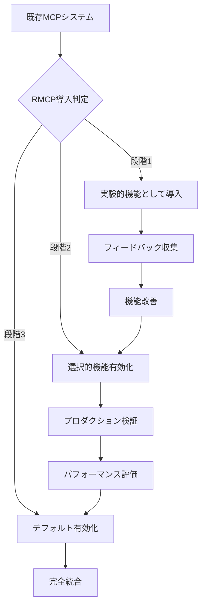

# Reliable MCP (RMCP) 設計書

## 1. システムアーキテクチャ

### 1.1 全体構成（MCP統合アーキテクチャ）

```
┌─────────────┐     ┌──────────────────┐     ┌─────────────┐
│   Agent     │────▶│   RMCP Wrapper   │────▶│    Tool     │
│   (Host)    │◀────│  + MCP Session   │◀────│  (Server)   │
└─────────────┘     └──────────────────┘     └─────────────┘
       │                     │                       │
       │              ┌──────▼──────┐                │
       │              │ MCP Client/ │                │
       │              │   Server    │                │
       │              │ (BaseSession)│               │
       │              └─────────────┘                │
       └─────────────────────┴───────────────────────┘
                     MCP Protocol (JSON-RPC)
                   + RMCP Reliability Layer
```

### 1.2 レイヤー構成（MCP統合モデル）

```
┌────────────────────────────────────┐
│        Application Layer           │
├────────────────────────────────────┤
│         RMCP Wrapper               │
│  ┌─────────────┬────────────────┐ │
│  │ Reliability │ State Manager  │ │
│  ├─────────────┼────────────────┤ │
│  │ Sequencing  │ Retry Logic    │ │
│  ├─────────────┼────────────────┤ │
│  │ Flow Control│ Transaction    │ │
│  └─────────────┴────────────────┘ │
├────────────────────────────────────┤
│      MCP Layer (BaseSession)       │
│  ┌─────────────┬────────────────┐ │
│  │ JSON-RPC ID │ Progress/Cancel│ │
│  ├─────────────┼────────────────┤ │
│  │ Error Handle│ Timeout Mgmt   │ │
│  └─────────────┴────────────────┘ │
├────────────────────────────────────┤
│   Transport Layer (stdio/WS/HTTP) │
└────────────────────────────────────┘
```

## 2. コンポーネント設計

### 2.1 Core Components

#### 2.1.1 Message Manager
```typescript
interface MessageManager {
  // メッセージのシーケンス管理
  assignSequence(message: RMCPMessage): number;
  validateSequence(message: RMCPMessage): boolean;
  resetSequence(connectionId: string): void;
  
  // メッセージキューイング
  enqueue(message: RMCPMessage): void;
  dequeue(): RMCPMessage | null;
  peekQueue(): RMCPMessage[];
  clearQueue(transactionId?: string): void;
  
  // メッセージ追跡
  trackMessage(messageId: string, status: MessageStatus): void;
  getMessageStatus(messageId: string): MessageStatus | null;
  getMessageHistory(transactionId: string): MessageRecord[];
}
```

#### 2.1.2 Transaction Manager
```typescript
interface TransactionManager {
  // トランザクション管理
  beginTransaction(): TransactionContext;
  commitTransaction(txId: string): void;
  rollbackTransaction(txId: string): void;
  
  // 状態管理
  getTransactionState(txId: string): TransactionState;
  updateTransactionState(txId: string, state: TransactionState): void;
  
  // タイムアウト管理
  setTransactionTimeout(txId: string, timeout: number): void;
}
```

#### 2.1.3 Retry Manager
```typescript
interface RetryManager {
  // 再送制御
  shouldRetry(message: RMCPMessage, error?: Error): boolean;
  scheduleRetry(message: RMCPMessage): void;
  cancelRetry(messageId: string): void;
  getPendingRetries(): RetryQueueItem[];
  
  // 再送ポリシー
  setRetryPolicy(policy: RetryPolicy): void;
  getRetryPolicy(): RetryPolicy;
  getNextRetryDelay(attemptCount: number): number;
  
  // バックオフ戦略
  applyBackoffStrategy(baseDelay: number, attempt: number): number;
  calculateJitter(delay: number): number;
}

interface RetryPolicy {
  maxAttempts: number;
  baseDelay: number;
  maxDelay: number;
  backoffMultiplier: number;
  jitterEnabled: boolean;
  retryableErrors: string[];
}
```

#### 2.1.4 Flow Controller
```typescript
interface FlowController {
  // レート制限
  checkRateLimit(): boolean;
  updateRateCounter(): void;
  
  // トークン管理
  checkTokenLimit(message: RMCPMessage): boolean;
  updateTokenCount(tokens: number): void;
  
  // ウィンドウ制御
  adjustWindowSize(performance: PerformanceMetrics): void;
}
```

### 2.2 データ構造

#### 2.2.1 RMCP Message
```typescript
interface RMCPMessage {
  // 基本MCP構造
  jsonrpc: "2.0";
  method?: string;
  params?: any;
  result?: any;
  error?: any;
  id: string | number;
  
  // RMCP拡張
  rmcp: {
    version: string;
    sequence: number;
    transaction_id: string;
    retry_count: number;
    timeout: number;
    timestamp: string;
    checksum?: string;
    priority?: 'low' | 'normal' | 'high';
    correlation_id?: string;
  };
}
```

#### 2.2.2 Transaction State
```typescript
enum TransactionState {
  INITIATED = "initiated",
  IN_PROGRESS = "in_progress",
  WAITING_ACK = "waiting_ack",
  COMPLETED = "completed",
  FAILED = "failed",
  TIMEOUT = "timeout",
  ROLLED_BACK = "rolled_back"
}

interface TransactionContext {
  id: string;
  state: TransactionState;
  created_at: Date;
  updated_at: Date;
  messages: RMCPMessage[];
  retry_attempts: number;
  final_status?: FinalStatus;
}
```

#### 2.2.3 Configuration
```typescript
interface RMCPConfig {
  // 基本設定
  version: string;
  enabled: boolean;
  
  // タイムアウト設定
  timeouts: {
    default: number;
    connection: number;
    request: number;
    transaction: number;
  };
  
  // 再送設定
  retry: {
    max_attempts: number;
    base_delay: number;
    max_delay: number;
    backoff_multiplier: number;
    jitter: boolean;
  };
  
  // フロー制御設定
  flow_control: {
    max_concurrent: number;
    rate_limit: number;
    token_limit: number;
    window_size: number;
  };
  
  // ロギング設定
  logging: {
    level: "debug" | "info" | "warn" | "error";
    include_payloads: boolean;
    max_payload_size: number;
  };
}
```

## 3. プロトコル仕様

### 3.1 メッセージフロー

#### 3.1.1 基本的な成功フロー
```
Agent                    RMCP Layer                    Tool
  │                          │                          │
  ├──── Request ────────────▶│                          │
  │    (seq: 1)              ├──── Forward Request ────▶│
  │                          │    (seq: 1, tx: abc)     │
  │                          │                          │
  │                          │◀─── Response ────────────┤
  │                          │    (ack: true)           │
  │◀─── Confirmed Response ──┤                          │
  │    (seq: 1, status: ok)  │                          │
```

#### 3.1.2 再送フロー
```
Agent                    RMCP Layer                    Tool
  │                          │                          │
  ├──── Request ────────────▶│                          │
  │    (seq: 1)              ├──── Forward Request ────▶│
  │                          │    (seq: 1, tx: abc)     │
  │                          │                          │
  │                          │      (Timeout)           │
  │                          │                          │
  │                          ├──── Retry Request ──────▶│
  │                          │    (retry: 1)            │
  │                          │                          │
  │                          │◀─── Response ────────────┤
  │◀─── Confirmed Response ──┤    (ack: true)           │
  │    (seq: 1, retry: 1)    │                          │
```

### 3.2 状態遷移

```
    ┌──────────┐
    │ INITIATED │
    └─────┬─────┘
          │ send()
    ┌─────▼──────┐
    │IN_PROGRESS │
    └─────┬──────┘
          │ 
    ┌─────▼──────┐     timeout      ┌─────────┐
    │WAITING_ACK ├─────────────────▶│ TIMEOUT │
    └─────┬──────┘                  └─────────┘
          │ ack                           │
    ┌─────▼──────┐                       │ retry
    │ COMPLETED  │                        │
    └────────────┘                  ┌─────▼──────┐
                                    │   RETRY    │
                                    └────────────┘
```

## 4. エラー処理

### 4.1 エラー分類

| エラータイプ | エラーコード | 説明 | 再送可否 | 処理方法 |
|------------|------------|------|---------|----------|
| Network Error | RMCP_NETWORK_ERROR | ネットワーク接続エラー | 可 | 自動再送 |
| Timeout | RMCP_TIMEOUT | 応答タイムアウト | 可 | 自動再送 |
| Sequence Error | RMCP_SEQUENCE_ERROR | シーケンス番号不整合 | 不可 | エラー通知 |
| Transaction Error | RMCP_TRANSACTION_ERROR | トランザクション失敗 | 条件付き | ロールバック |
| Rate Limit | RMCP_RATE_LIMIT | レート制限超過 | 可 | 遅延後再送 |
| Invalid Message | RMCP_INVALID_MESSAGE | メッセージ形式エラー | 不可 | エラー通知 |
| Protocol Version | RMCP_VERSION_MISMATCH | プロトコルバージョン不一致 | 不可 | ネゴシエーション |
| Resource Exhausted | RMCP_RESOURCE_EXHAUSTED | リソース枯渇 | 可 | バックプレッシャー |

### 4.2 エラーレスポンス形式
```json
{
  "jsonrpc": "2.0",
  "error": {
    "code": -32000,
    "message": "RMCP Error",
    "data": {
      "type": "timeout",
      "transaction_id": "550e8400-e29b-41d4-a716-446655440000",
      "retry_count": 3,
      "details": "Request timeout after 30 seconds"
    }
  },
  "id": "original-request-id",
  "rmcp": {
    "sequence": 42,
    "status": "failed"
  }
}
```

## 5. セキュリティ設計

### 5.1 認証・認可
- MCPの既存認証機構を継承
- トランザクションIDによる要求の一意性保証
- リプレイ攻撃防止のためのタイムスタンプ検証

### 5.2 データ保護
- オプショナルなメッセージチェックサム
- TLS暗号化の必須化
- センシティブデータのログマスキング

### 5.3 DoS対策
- レート制限機能（トークンバケット方式）
- 同時接続数制限（コネクションプール管理）
- タイムアウト設定の適切な管理
- 異常なメッセージサイズの検出とブロック
- IPベースのアクセス制限
- サーキットブレーカーパターンの実装

## 6. パフォーマンス最適化

### 6.1 キャッシング戦略
```typescript
interface CacheStrategy {
  // レスポンスキャッシュ
  cacheResponse(key: string, response: any, ttl: number): void;
  getCachedResponse(key: string): any | null;
  
  // トランザクションキャッシュ
  cacheTransaction(txId: string, context: TransactionContext): void;
  evictOldTransactions(maxAge: number): void;
}
```

### 6.2 大ファイル処理と順序制御
```typescript
interface LargeFileProcessor {
  // チャンク処理
  splitToChunks(data: Buffer, chunkSize: number): Chunk[];
  reassembleChunks(chunks: Chunk[], ordered: boolean): Buffer;
  
  // 並列処理（デフォルト）
  processParallelChunks(chunks: Chunk[]): Promise<Buffer>;
  
  // 順序処理（ストリーミング用）
  processOrderedChunks(chunks: Chunk[]): Promise<ReadableStream>;
  
  // ハイブリッド処理
  processBufferedChunks(chunks: Chunk[]): Promise<ReadableStream>;
  
  // 整合性確認
  calculateFileHash(data: Buffer): string;
  validateChunkIntegrity(chunk: Chunk, expectedHash: string): boolean;
}

interface Chunk {
  index: number;           // チャンクの位置
  data: Buffer;           // チャンクデータ
  hash: string;           // チャンクハッシュ
  transferId: string;     // 転送セッションID
  sequence?: number;      // 順序が必要な場合のシーケンス番号
}
```

#### チャンク順序制御の実装例
```typescript
class ChunkManager {
  // デフォルト: 並列処理（順序不要）
  async receiveParallel(chunks: Chunk[]): Promise<Buffer> {
    // 全チャンク受信を待つ（順序無関係）
    const allChunks = await Promise.all(chunks);
    return this.reassembleByIndex(allChunks);
  }
  
  // ストリーミング: 順序処理
  async receiveOrdered(chunks: Chunk[]): Promise<ReadableStream> {
    const buffer = new Map<number, Chunk>();
    let expectedIndex = 0;
    
    for (const chunk of chunks) {
      buffer.set(chunk.index, chunk);
      
      // 順序通りのチャンクを処理
      while (buffer.has(expectedIndex)) {
        yield buffer.get(expectedIndex)!.data;
        buffer.delete(expectedIndex);
        expectedIndex++;
      }
    }
  }
}
```

## 7. モニタリング・可観測性

### 7.1 メトリクス
```typescript
interface RMCPMetrics {
  // 基本メトリクス
  total_requests: number;
  successful_requests: number;
  failed_requests: number;
  
  // パフォーマンスメトリクス
  average_latency: number;
  p95_latency: number;
  p99_latency: number;
  
  // 再送メトリクス
  total_retries: number;
  retry_success_rate: number;
  
  // トランザクションメトリクス
  active_transactions: number;
  completed_transactions: number;
  failed_transactions: number;
}
```

### 7.2 ロギング形式
```json
{
  "timestamp": "2024-01-01T12:00:00Z",
  "level": "info",
  "component": "rmcp",
  "transaction_id": "550e8400-e29b-41d4-a716-446655440000",
  "sequence": 42,
  "event": "message_sent",
  "details": {
    "method": "tool.execute",
    "retry_count": 0,
    "latency_ms": 45
  },
  "context": {
    "agent_id": "agent-123",
    "tool_id": "file_reader",
    "connection_id": "conn-456"
  },
  "metrics": {
    "queue_size": 5,
    "active_transactions": 3
  }
}
```

## 8. 実装ガイドライン

### 8.1 インターフェース実装例

#### クライアント側
```typescript
class RMCPClient implements MCPClient {
  private messageManager: MessageManager;
  private transactionManager: TransactionManager;
  private retryManager: RetryManager;
  
  async send(request: MCPRequest): Promise<MCPResponse> {
    // RMCPメタデータを追加
    const rmcpMessage = this.wrapMessage(request);
    
    // トランザクション開始
    const tx = this.transactionManager.beginTransaction();
    
    try {
      // メッセージ送信と再送制御
      const response = await this.sendWithRetry(rmcpMessage, tx);
      
      // トランザクションコミット
      this.transactionManager.commitTransaction(tx.id);
      
      return this.unwrapMessage(response);
    } catch (error) {
      // トランザクションロールバック
      this.transactionManager.rollbackTransaction(tx.id);
      throw error;
    }
  }
}
```

#### サーバー側
```typescript
class RMCPServer implements MCPServer {
  private sequenceValidator: SequenceValidator;
  private ackManager: AcknowledgmentManager;
  
  async handleRequest(request: RMCPMessage): Promise<RMCPMessage> {
    // シーケンス検証
    if (!this.sequenceValidator.validate(request)) {
      return this.createErrorResponse(request, "SEQUENCE_ERROR");
    }
    
    try {
      // 実際の処理を実行
      const result = await this.processRequest(request);
      
      // ACK付きレスポンスを生成
      return this.createAckResponse(request, result);
    } catch (error) {
      // NACK付きエラーレスポンスを生成
      return this.createNackResponse(request, error);
    }
  }
}
```

### 8.2 設定例
```yaml
rmcp:
  version: "1.0"
  enabled: true
  
  timeouts:
    default: 30000
    connection: 10000
    request: 60000
    transaction: 300000
  
  retry:
    max_attempts: 3
    base_delay: 1000
    max_delay: 30000
    backoff_multiplier: 2.0
    jitter: true
  
  flow_control:
    max_concurrent: 10
    rate_limit: 100
    token_limit: 4000
    window_size: 50
  
  logging:
    level: "info"
    include_payloads: false
    max_payload_size: 1024
```

## 9. テスト戦略

### 9.1 単体テスト
- 各コンポーネントの独立したテスト
- モックを使用した境界テスト
- エラーケースの網羅的テスト

### 9.2 統合テスト
- エンドツーエンドのメッセージフロー
- 再送シナリオのテスト
- 並行処理とレースコンディションのテスト

### 9.3 性能テスト
- レイテンシ測定
- スループット測定
- 負荷テストとストレステスト

## 10. 移行計画

### 10.1 段階的導入
1. **Phase 1**: オプトイン機能として提供
2. **Phase 2**: デフォルト有効化（オプトアウト可能）
3. **Phase 3**: 完全移行

### 10.2 後方互換性
- RMCPメタデータなしのメッセージも処理可能
- バージョンネゴシエーション機能
- グレースフルダウングレード
- レガシーMCPクライアントのためのプロキシモード
- 機能検出とケイパビリティ交換

## 11. 運用ガイドライン

### 11.1 デプロイメント
- Dockerコンテナでの提供
- Kubernetes Helmチャートの提供
- 環境変数による設定管理
- ヘルスチェックエンドポイント

### 11.2 監視とアラート
- Prometheusメトリクスエクスポート
- Grafanaダッシュボードテンプレート
- アラート閾値の推奨設定
- SLI/SLOの定義

### 11.3 トラブルシューティング
- 一般的な問題と解決方法
- デバッグモードの有効化
- ログレベルの動的変更
- パフォーマンスプロファイリング

## 12. MCP統合設計

### 12.1 BaseSessionラッパー実装

```typescript
class RMCPSession extends BaseSession {
  private mcpSession: BaseSession;
  private rmcpEnabled: boolean;
  private sequenceManager: SequenceManager;
  private transactionManager: TransactionManager;
  private retryManager: RetryManager;
  
  constructor(mcpSession: BaseSession, config: RMCPConfig) {
    super();
    this.mcpSession = mcpSession;
    this.rmcpEnabled = false; // 初期化時に決定
  }
  
  async initialize(params: InitializeParams): Promise<InitializeResult> {
    // MCP初期化にRMCPケイパビリティを追加
    const extendedParams = this.addRMCPCapabilities(params);
    const result = await this.mcpSession.initialize(extendedParams);
    
    // サーバーのRMCPサポートを確認
    this.rmcpEnabled = this.checkRMCPSupport(result);
    
    return result;
  }
  
  async send(request: JSONRPCRequest): Promise<JSONRPCResponse> {
    if (!this.rmcpEnabled) {
      // 標準MCPとして動作
      return this.mcpSession.send(request);
    }
    
    // RMCP機能付きで送信
    return this.sendWithRMCP(request);
  }
}
```

### 12.2 メタデータ統合戦略

```typescript
interface MCPMessageWithRMCP extends JSONRPCRequest {
  params?: {
    _meta?: {
      rmcp?: {
        sequence: number;
        transaction_id: string;
        retry_count: number;
        timeout: number;
        correlation_id?: string;
      };
    };
  };
}
```

### 12.3 エラーマッピング

```typescript
class ErrorMapper {
  static mapMCPToRMCP(mcpError: McpError): RMCPError {
    switch (mcpError.code) {
      case CONNECTION_CLOSED:
        return new RMCPError("RMCP_CONNECTION_ERROR", mcpError.message);
      case INVALID_PARAMS:
        return new RMCPError("RMCP_INVALID_MESSAGE", mcpError.message);
      default:
        return new RMCPError("RMCP_UNKNOWN_ERROR", mcpError.message);
    }
  }
  
  static mapRMCPToMCP(rmcpError: RMCPError): McpError {
    // RMCPエラーを適切なMCPエラーコードに変換
  }
}
```

### 12.4 プログレス通知統合

```typescript
class ProgressIntegration {
  async handleProgressNotification(
    progressToken: ProgressToken,
    notification: ProgressNotification
  ): Promise<void> {
    // MCPのプログレス通知をRMCPトランザクション状態と同期
    const transactionId = this.getTransactionForProgress(progressToken);
    await this.transactionManager.updateProgress(transactionId, notification);
  }
}
```

### 12.5 キャンセル統合

```typescript
class CancellationIntegration {
  async handleCancellation(requestId: RequestId): Promise<void> {
    // MCPのキャンセル機能とRMCPのタイムアウト管理を連携
    await this.mcpSession.cancel(requestId);
    await this.rmcpManager.markAsCancelled(requestId);
  }
}
```

### 12.6 段階的移行パス



---

**作成日**: 2025-01-19  
**更新日**: 2025-01-19  
**バージョン**: 1.1  
**ステータス**: レビュー済み

---

## 日本語要約

### システムアーキテクチャ
- MCPセッションをラップするRMCP層
- BaseSessionの拡張による透過的統合
- `experimental`フィールドでの機能ネゴシエーション

### コア機能
- **メッセージ管理**: 冪等性キーによる重複検出
- **トランザクション管理**: UUID生成と状態遷移管理
- **再送制御**: 指数バックオフ + Jitter
- **フロー制御**: レート制限、トークンバケット方式

### 大ファイル処理
- チャンク分割転送（デフォルト10MB）
- 並列処理（順序不要）と順序処理（ストリーミング）の選択可能
- ハッシュベースの整合性確認

### エラー処理
- 再送可能/不可能エラーの分類
- カスケード障害防止
- サーキットブレーカーパターン

### モニタリング
- Prometheusメトリクス
- 構造化ログ（JSON形式）
- OpenTelemetry対応

### MCP統合設計
- `_meta.rmcp`フィールドでメタデータ埋め込み
- MCPエラーコードとの連携
- プログレス通知・キャンセル機能の統合
- 段階的移行パス（実験→選択→デフォルト）