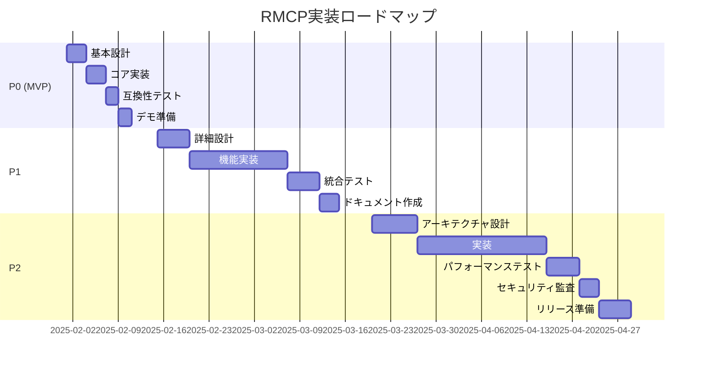

# MCP-Tx MVP仕様書

## 概要
本ドキュメントは、MCP-Txの段階的実装計画を定義する。P0（MVP/概念検証）から始まり、P1、P2と段階的に機能を追加していく。

## MCP後方互換性の原則

MCP-Txは既存のMCPエコシステムとの完全な後方互換性を維持することを最優先とする。

### 互換性要件
1. **透過的な動作**: MCP-Txメタデータを理解しないMCPサーバー/クライアントとも通信可能
2. **オプトイン方式**: MCP-Tx機能は明示的に有効化された場合のみ動作
3. **グレースフルダウングレード**: MCP-Tx非対応の相手との通信時は標準MCPとして動作
4. **プロトコルネゴシエーション**: 初期化時に双方の能力を確認し、適切なモードを選択

## 実装フェーズ概要

| フェーズ | 目的 | 期間 | 主要機能 |
|---------|------|------|----------|
| P0 (MVP) | 概念検証 | 2-3週間 | シーケンス番号、基本ACK、単純再送 |
| P1 | 基本機能実装 | 4-6週間 | トランザクション、高度な再送、フロー制御 |
| P2 | プロダクション対応 | 6-8週間 | モニタリング、セキュリティ、最適化 |

---

## P0: MVP (概念検証)

### 目的
**最小限のACK機能と再送制御**でMCP-Txの核心である信頼性を実証する。

### スコープ
- **含む**: 基本的なACK/NACK、単純な再送制御
- **含まない**: シーケンス番号、トランザクション管理、高度なエラー処理

### 主要機能（信頼性の核心のみ）

#### 1. 基本的なACK/NACK機能
```typescript
interface P0Response {
  jsonrpc: "2.0";
  result?: any;
  error?: any;
  id: string | number;
  
  // MCP-Tx最小拡張
  _meta?: {
    mcp_tx?: {
      ack: boolean;     // 受信確認（必須）
      processed: boolean; // 処理完了確認
    };
  };
}
```

#### 2. 簡単な再送制御
- 固定回数の再送（3回）
- 固定間隔の再送（5秒）
- タイムアウト: 30秒
- ACKが返らない場合のみ再送

#### 3. MCPの_metaフィールドでMCP-Tx情報
```typescript
interface P0Request {
  jsonrpc: "2.0";
  method?: string;
  params?: {
    _meta?: {
      mcp_tx?: {
        expect_ack: true;  // ACKを期待することを明示
        request_id: string; // 重複検出用の一意ID
      };
    };
    [key: string]: any;
  };
  id: string | number;
}
```

### 後方互換性の実装

#### 初期化時のケイパビリティネゴシエーション
```typescript
// P0では信頼性の核心機能のみ
interface P0ClientCapabilities extends ClientCapabilities {
  experimental?: {
    mcp_tx?: {
      version: "0.1.0";
      features: ["ack", "retry"];  // ACKと再送の基本機能
    };
  };
}
```

### 実装詳細

#### クライアント側（ACK付き最小実装）
```typescript
class P0MCPTxClient {
  private mcpTxEnabled = false;
  
  async initialize(params: InitializeParams): Promise<InitializeResult> {
    const extendedParams = {
      ...params,
      capabilities: {
        ...params.capabilities,
        experimental: {
          mcp_tx: { version: "0.1.0", features: ["ack", "retry"] }
        }
      }
    };
    
    const result = await this.baseClient.initialize(extendedParams);
    this.mcpTxEnabled = !!(result.capabilities?.experimental?.mcp_tx);
    return result;
  }
  
  async send(request: any): Promise<any> {
    if (!this.mcpTxEnabled) {
      return this.baseClient.send(request);
    }
    
    // MCP-Txリクエストとして送信
    const mcpTxRequest = {
      ...request,
      params: {
        ...request.params,
        _meta: {
          ...request.params?._meta,
          mcp_tx: {
            expect_ack: true,
            request_id: this.generateRequestId()
          }
        }
      }
    };
    
    // ACKベースの再送制御
    for (let attempt = 0; attempt < 3; attempt++) {
      try {
        const response = await this.baseClient.send(mcpTxRequest);
        
        // ACKチェック
        if (response._meta?.mcp_tx?.ack === true) {
          return response;  // 成功
        } else if (response._meta?.mcp_tx?.ack === false) {
          throw new Error("Server NACK received");
        }
        // ACKフィールドがない場合は標準MCPレスポンスとして扱う
        return response;
        
      } catch (error) {
        if (attempt === 2) throw error;
        await this.sleep(5000);
      }
    }
  }
  
  private generateRequestId(): string {
    return `mcp-tx-${Date.now()}-${Math.random().toString(36).substr(2, 9)}`;
  }
}
```

#### サーバー側（ACK対応最小実装）
```typescript
class P0MCPTxServer {
  private mcpTxEnabled = false;
  private processedRequests = new Set<string>(); // 重複検出用
  
  async handleInitialize(params: InitializeParams): Promise<InitializeResult> {
    const clientMcpTx = params.capabilities?.experimental?.mcp_tx;
    this.mcpTxEnabled = !!clientMcpTx;
    
    const baseResult = await this.baseServer.handleInitialize(params);
    
    if (this.mcpTxEnabled) {
      return {
        ...baseResult,
        capabilities: {
          ...baseResult.capabilities,
          experimental: {
            mcp_tx: { version: "0.1.0", features: ["ack", "retry"] }
          }
        }
      };
    }
    return baseResult;
  }
  
  async handleRequest(request: any): Promise<any> {
    const mcpTxMeta = request.params?._meta?.mcp_tx;
    
    if (!this.mcpTxEnabled || !mcpTxMeta?.expect_ack) {
      // 標準MCPとして処理
      return this.baseServer.handleRequest(request);
    }
    
    // 重複リクエストチェック
    if (mcpTxMeta.request_id && this.processedRequests.has(mcpTxMeta.request_id)) {
      return this.createDuplicateResponse(request);
    }
    
    try {
      const result = await this.baseServer.handleRequest(request);
      
      // リクエストIDを記録
      if (mcpTxMeta.request_id) {
        this.processedRequests.add(mcpTxMeta.request_id);
      }
      
      // ACK付きレスポンス
      return {
        ...result,
        _meta: {
          ...result._meta,
          mcp_tx: {
            ack: true,
            processed: true
          }
        }
      };
    } catch (error) {
      // NACK付きエラーレスポンス
      return {
        jsonrpc: "2.0",
        error: {
          code: -32000,
          message: error.message
        },
        id: request.id,
        _meta: {
          mcp_tx: {
            ack: false,
            processed: false
          }
        }
      };
    }
  }
  
  private createDuplicateResponse(request: any): any {
    return {
      jsonrpc: "2.0",
      result: { message: "Request already processed" },
      id: request.id,
      _meta: {
        mcp_tx: {
          ack: true,
          processed: true,
          duplicate: true
        }
      }
    };
  }
}
```

### 後方互換性テストケース

#### 相互運用性マトリクス
| クライアント | サーバー | 期待動作 |
|-------------|----------|----------|
| MCP-Tx対応 | MCP-Tx対応 | MCP-Tx機能有効 |
| MCP-Tx対応 | MCP標準 | 標準MCPとして動作 |
| MCP標準 | MCP-Tx対応 | 標準MCPとして動作 |
| MCP標準 | MCP標準 | 標準MCPとして動作 |

#### 互換性テストシナリオ
1. **MCP-Tx→MCP通信**
   - MCP-Txクライアントが標準MCPサーバーに接続
   - 初期化時にMCP-Tx機能が無効化されることを確認
   - 標準MCPメッセージのみが送信されることを確認

2. **MCP→MCP-Tx通信**
   - 標準MCPクライアントがMCP-Txサーバーに接続
   - MCP-Txメタデータなしでもリクエストが処理されることを確認
   - レスポンスにMCP-Txメタデータが含まれないことを確認

3. **混在環境**
   - 同一ホストで複数のクライアント（MCP-Tx/MCP混在）を実行
   - 各接続が独立して適切なモードで動作することを確認

### テスト計画（ACK中心）
1. **ACK成功ケース**: MCP-Txリクエスト→ACK付きレスポンス受信
2. **NACK処理ケース**: サーバーエラー→NACK付きレスポンス受信
3. **再送ケース**: ACKタイムアウト→再送→ACK受信
4. **重複検出ケース**: 同一request_idの重複リクエスト処理
5. **後方互換性**: 相互運用性マトリクスの全パターン

### 成功基準（信頼性重視）
- [ ] ACK/NACKが正しく送受信される
- [ ] ACKがない場合に自動再送される
- [ ] 重複リクエストが適切に検出・処理される
- [ ] 既存のMCPクライアント/サーバーとの完全な互換性維持
- [ ] MCP-Tx機能が標準MCPの動作に影響しない

---

## P1: 実用機能実装

### 目的
MCPの用途に最適化された実用的な信頼性機能を実装する。

### 追加機能（MCPに最適化）

#### 1. 冪等性サポート
```typescript
interface P1Message {
  params?: {
    _meta?: {
      mcp_tx?: {
        expect_ack: true;
        request_id: string;
        idempotency_key: string; // 冪等性キー（新規）
        operation_type: "read" | "write" | "delete"; // 操作タイプ
      };
    };
  };
}
```

#### 2. 高度な再送制御
- 指数バックオフ（1秒→2秒→4秒→8秒）
- Jitter追加（±20%）
- 操作タイプ別の再送ポリシー

#### 3. MCP最適化エラー分類
```typescript
enum P1ErrorType {
  TOOL_UNAVAILABLE = "tool_unavailable",   // 再送可能
  TOOL_ERROR = "tool_error",               // 再送不可
  RESOURCE_BUSY = "resource_busy",         // 遅延後再送
  PERMISSION_DENIED = "permission_denied"  // 再送不可
}
```

#### 4. リクエスト追跡
```typescript
interface RequestTracker {
  request_id: string;
  idempotency_key: string;
  status: "pending" | "processing" | "completed" | "failed";
  tool_name: string;
  created_at: Date;
  attempts: number;
  last_error?: string;
}
```

#### 5. ツール状態管理
- ツール別の負荷制限
- リソース競合検出
- 依存関係のあるツール呼び出しの順序保証（オプション）

### 実装の拡張点
- メッセージキューの実装
- トランザクションストアの追加
- 設定可能な再送ポリシー
- エラーハンドリングの強化

### テスト計画
- 指数バックオフの動作確認
- トランザクション状態遷移のテスト
- フロー制御の境界値テスト
- 異なるエラータイプの処理確認

### 成功基準
- [ ] トランザクション単位での状態追跡
- [ ] カスタマイズ可能な再送戦略
- [ ] 適切なエラー分類と処理
- [ ] 基本的な過負荷保護

---

## P2: プロダクション対応

### 目的
エンタープライズレベルの要求に応えられる、完全な信頼性保証レイヤーを実現する。

### 追加機能

#### 1. 大ファイル処理対応
```typescript
interface P2ChunkedTransfer {
  chunk_size: number;        // チャンクサイズ（デフォルト: 10MB）
  total_chunks: number;      // 総チャンク数
  chunk_index: number;       // 現在のチャンクインデックス
  file_hash: string;         // ファイル全体のハッシュ（整合性確認）
  transfer_id: string;       // 転送セッションID
  ordered: boolean;          // 順序保証が必要か（デフォルト: false）
  processing_mode: "batch" | "streaming"; // 処理モード
}

interface P2StreamingRequest {
  params?: {
    _meta?: {
      mcp_tx?: {
        chunked_transfer?: P2ChunkedTransfer;
        content_length?: number;
      };
    };
  };
}
```

#### チャンク処理戦略
```typescript
enum ChunkStrategy {
  // 並列受信（デフォルト）- 最高速度
  PARALLEL_UNORDERED = "parallel_unordered",
  
  // 順序保証 - ストリーミング処理用
  SEQUENTIAL_ORDERED = "sequential_ordered",
  
  // ハイブリッド - 並列受信、順序バッファリング
  PARALLEL_BUFFERED = "parallel_buffered"
}
```

#### 2. 包括的なモニタリング
```typescript
interface MCPTxMetrics {
  // リアルタイムメトリクス
  requests_per_second: number;
  success_rate: number;
  average_latency_ms: number;
  p95_latency_ms: number;
  p99_latency_ms: number;
  
  // 累積メトリクス
  total_requests: Counter;
  total_retries: Counter;
  total_failures: Counter;
  
  // 状態メトリクス
  active_transactions: Gauge;
  queue_size: Gauge;
}
```

#### 2. セキュリティ強化
- メッセージ署名/検証
- レート制限の高度化（トークンバケット）
- サーキットブレーカーパターン
- DDoS保護

#### 3. パフォーマンス最適化
- メッセージバッチング
- 接続プーリング
- レスポンスキャッシング
- ゼロコピー最適化

#### 4. 運用機能
- ヘルスチェックエンドポイント
- グレースフルシャットダウン
- 設定のホットリロード
- デバッグモード

#### 5. 高度なエラー処理
- カスケード障害の防止
- 自動リカバリー戦略
- エラー予算の管理
- インテリジェントな再送判定

#### 6. プロトコル拡張
```typescript
interface P2Message {
  mcp_tx?: {
    // P1の機能 + 以下
    version: string;        // プロトコルバージョン
    priority: "low" | "normal" | "high";
    deadline: string;       // RFC3339形式
    trace_id: string;      // 分散トレーシング
    compression?: "gzip" | "zstd";
  };
}
```

### 統合要件
- OpenTelemetry対応
- Prometheus/Grafanaダッシュボード
- Kubernetes Operator
- gRPCゲートウェイ

### パフォーマンス目標
- レイテンシオーバーヘッド: < 5%
- スループット: 10,000 req/sec
- メモリ使用量: < 100MB（アイドル時）
- CPU使用率: < 5%（アイドル時）

### 成功基準
- [ ] SLA 99.99%の達成
- [ ] 完全な可観測性
- [ ] エンタープライズレベルのセキュリティ
- [ ] 大規模環境での安定動作

---

## 段階的移行シナリオ

### Phase 1: 早期採用者向け（P0完了後）
- オプトインでMCP-Tx機能を試験的に利用可能
- 開発環境での検証を推奨
- フィードバック収集とバグ修正

### Phase 2: プロダクション試験（P1完了後）
- 選択的な本番環境での利用開始
- 段階的なロールアウト（カナリアデプロイ）
- パフォーマンスメトリクスの収集

### Phase 3: 一般提供（P2完了後）
- デフォルトでMCP-Tx機能を有効化（オプトアウト可能）
- 移行ガイドとツールの提供
- コミュニティサポートの確立

## 実装ロードマップ



## リスクと軽減策

### P0のリスク
- **リスク**: 概念が実証できない
- **軽減策**: スコープを最小限に絞り、早期のフィードバック収集

### P1のリスク
- **リスク**: 複雑性の急激な増加
- **軽減策**: 段階的な機能追加、十分なテスト

### P2のリスク
- **リスク**: パフォーマンス目標の未達成
- **軽減策**: 早期のベンチマーク、プロファイリング重視

---

**作成日**: 2025-01-19  
**バージョン**: 1.0  
**ステータス**: ドラフト